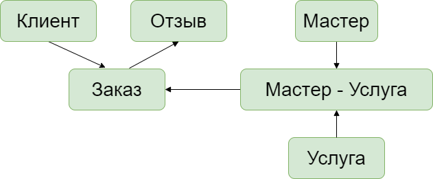
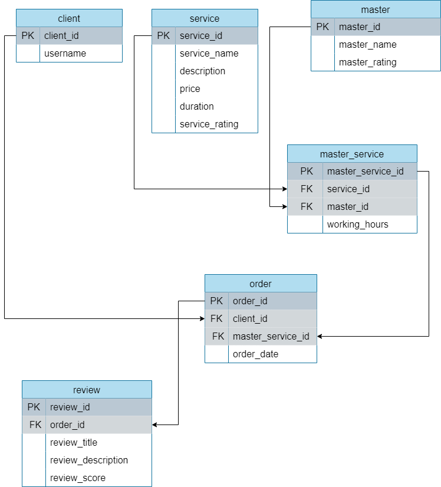

# Постановка задачи

Сервис для пользователей, которые хотят обеспечить своих животных качественным уходом, но не имеют на это достаточно времени. На сервисе пользователи могут выбирать мастеров по уходу за животными, а также бронировать услуги, такие как выгул, кормление, гигиенические процедуры и лечение. Мастера по уходу за животными могут создавать свои профили на платформе и получать уведомления о новых бронированиях через систему обмена сообщениями. Сервис может требовать предоставление мастерами документов о квалификации. Сервис может также предоставлять возможность оценки качества(отзывов) мастеров. Это поможет другим пользователям выбрать лучшего мастера и обеспечить высокое качество услуг на платформе.

---

## Концептуальная модель

## Логическая модель

